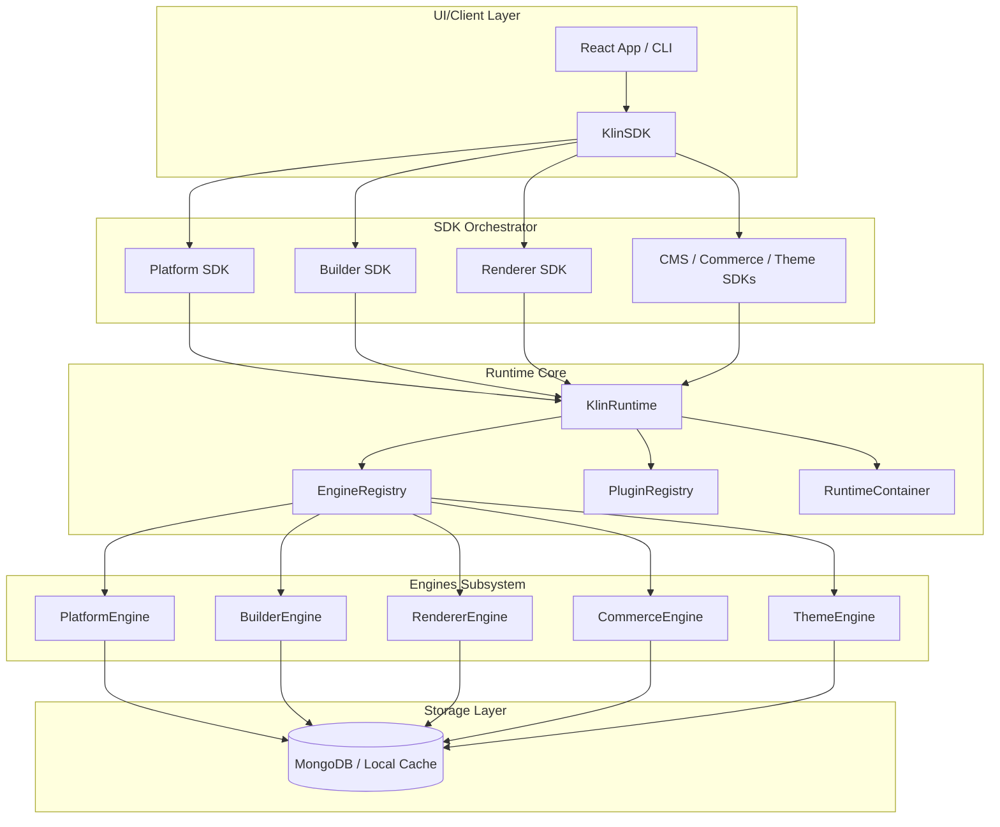
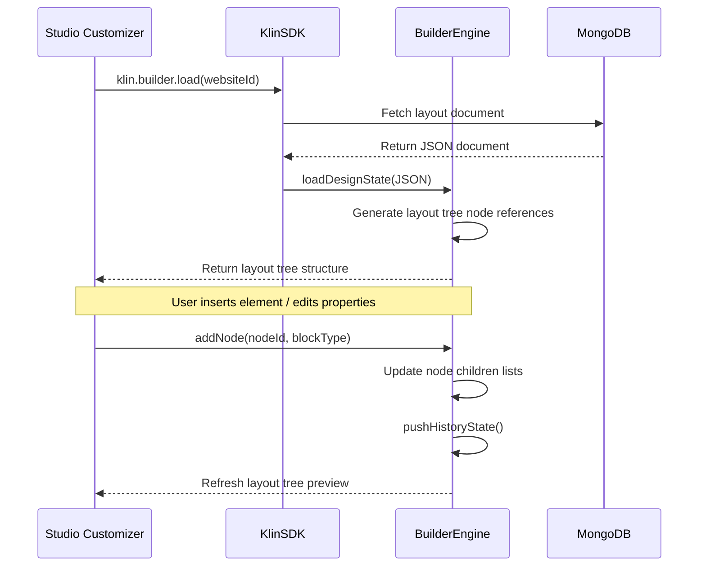
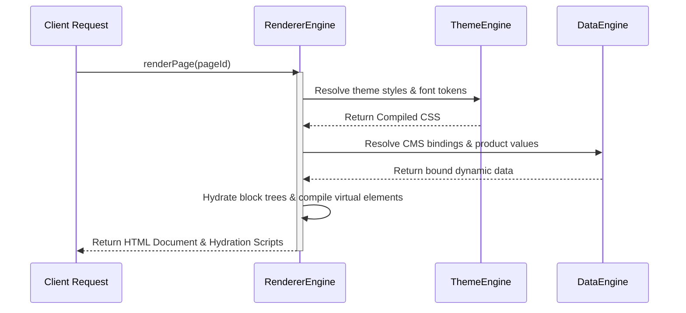
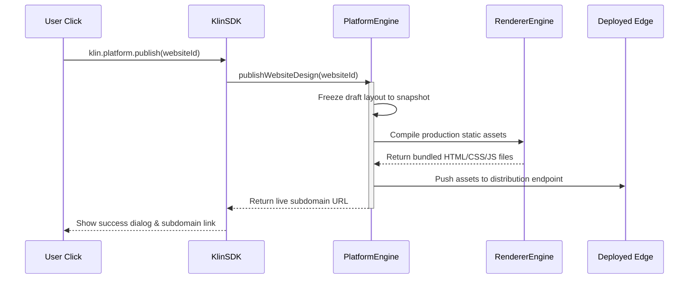
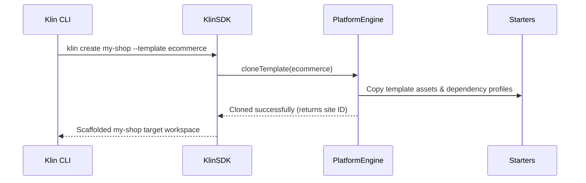

# Klin Platform Architecture & Dependency Guidelines

This document details the architectural specifications, engine interactions, and dependency rules governing the **Klin Framework**.

---

## 1. Engine Diagram



---

## 2. Dependency Graph

Framework packages must adhere strictly to a top-down dependency design. Reverse imports from `apps/` or other restricted packages are forbidden.

```mermaid
graph TD
    core[@klin/core] --> data[@klin/data]
    data --> theme[@klin/theme]
    theme --> blocks[@klin/blocks]
    blocks --> builder[@klin/builder]
    builder --> renderer[@klin/renderer]
    renderer --> platform[@klin/platform]
    platform --> commerce[@klin/commerce]
    commerce --> devtools[@klin/devtools]
    
    subgraph Framework Boundary
        core
        data
        theme
        blocks
        builder
        renderer
        platform
        commerce
        devtools
    end
    
    apps[apps/web, apps/studio] --> sdk[@klin/sdk]
    sdk --> core
```

---

## 3. Runtime Flow

```mermaid
sequenceDiagram
    participant App as Client Application
    participant R as KlinRuntime
    participant ER as EngineRegistry
    participant PE as PlatformEngine
    participant RE as RendererEngine

    App->>R: KlinRuntime.getInstance()
    App->>R: registerPlatformEngine(new PlatformEngine())
    App->>R: registerRendererEngine(new RendererEngine())
    App->>R: boot()
    activate R
    R->>ER: Initialize PlatformEngine
    R->>ER: Initialize RendererEngine
    R: State transition -> READY
    R-->>App: Boot Completed
    deactivate R
```

---

## 4. Builder Flow



---

## 5. Renderer Flow



---

## 6. Publishing Flow



---

## 7. Workspace Flow



---

## 8. Dependency Rules

1. **Framework Isolation:** Sibling engine dependencies under `packages/` must go strictly downwards. Sibling packages may only query other sibling APIs via `KlinRuntime.getInstance().engines` or public export entries.
2. **Reverse imports are strictly forbidden:** Sibling engines or framework layers must never import code from `apps/` (such as `apps/web/` or custom dashboard pages).
3. **No direct instantiation:** Sibling packages must not directly call `new OtherEngine()`. They must resolve engines via the runtime service locator.
