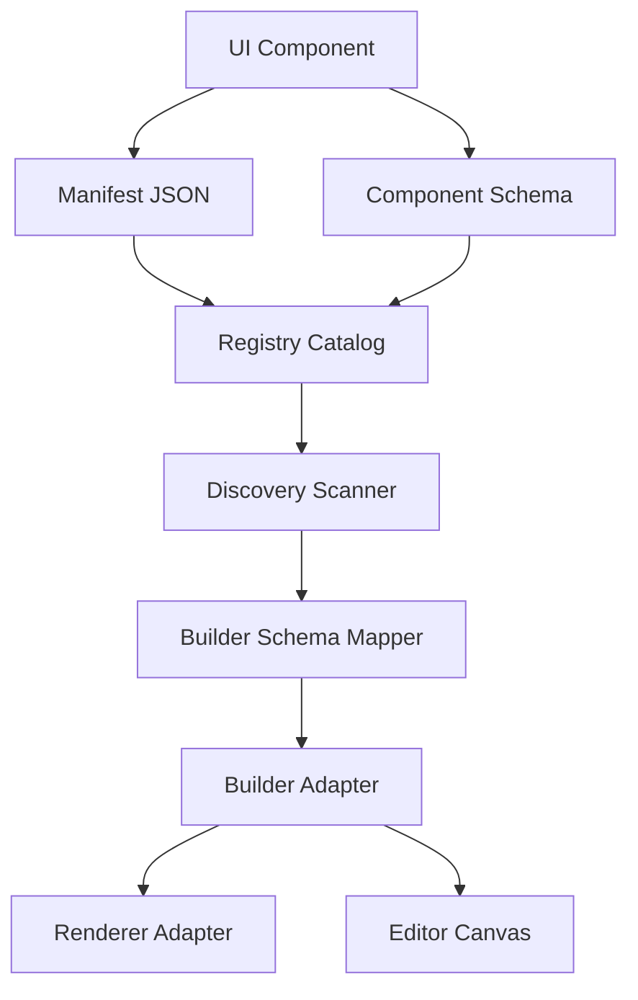

# Builder Architecture

The visual site customizer in Klin is designed around the concept of a decoupled editor engine. Rather than binding our design components directly to visual builder tools, we isolate components behind universal builder-agnostic contracts.

## Key Subsystems

### 1. IBuilderAdapter & BuilderAdapter
The main entry points that wrap visual editor layers.
* **IBuilderAdapter**: Defines the initialization, configuration generation, and plugin hooks interfaces.
* **BuilderAdapter**: The concrete implementation wrapping Puck. Converts Discovery outputs into editor configurations.

### 2. EditorState & BuilderSession
Manages state cleanly across canvas elements.
* **EditorState**: Stores runtime canvas coordinates, outlines, selection indices, and save flags.
* **BuilderSession**: Stores UI-only settings like grid snappings and panel positioning.

### 3. Builder Schema Mapper & Puck Field Mapper
* **BuilderSchemaMapper**: Maps core component schemas into intermediate representation schemas (`BuilderSchema`).
* **PuckFieldMapper**: Maps the intermediate representation schemas into Puck-specific property controls.

### 4. Renderer Adapter
Exposes an interface (`RendererAdapter`) that abstracts rendering layouts. This allows components to be rendered across React, Vue, or static HTML depending on the storefront configuration.
