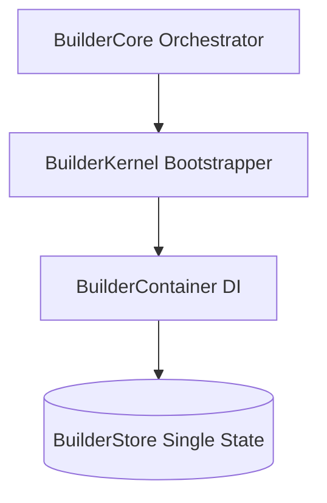

# Builder Core Architecture

This document outlines the architecture, lifecycles, and coordination mechanisms within `@klin/builder-core`.

---

## 1. Modular Architecture Overview

Builder Core acts as the **Editor Operating System**, orchestrating and coordinating visual editor features while remaining completely detached from rendering libraries or canvas view backends (such as Puck).

---

## 2. Boot & Shutdown Sequences

### Boot Pipeline
1. **Instantiation**: `BuilderCore` starts and initializes the state lifecycle in `Created` mode.
2. **Kernel Boot**: Instantiates the container and registers the core dependencies (Registry, EventBus, CommandEngine, ThemeEngine).
3. **Store & Services Activation**: Sets up the state store and the Event, Theme, Registry, and Command Service wrappers.
4. **Managers Allocation**: Allocates workspace, selection, history, clipboard, viewport, guides, autosave, shortcuts, and plugin managers.
5. **Autosave Loops**: Begins the debounced autosave checker process.
6. **State Switch**: Transitions lifecycle state to `Ready`.

### Shutdown Pipeline
1. **Deactivation**: Core receives the `destroy()` trigger.
2. **Lifecycle Transition**: State transitions to `Disposed`.
3. **Autosave Clean**: Clears active setTimeout buffers inside `AutosaveManager`.
4. **Plugins Unload**: Unloads and cleans active plugins.

---

## 3. Decoupled Service Wrappers

To minimize tight coupling to base engine libraries, managers execute tasks using Service wrapper classes:
* **EventService**: Abstract wrapper around `@klin/event-bus` publishing.
* **ThemeService**: Abstract wrapper around `@klin/theme` switches.
* **RegistryService**: Abstract wrapper around component type lookup catalogs.
* **CommandService**: Abstract wrapper routing undo/redo and actions to `@klin/command-engine`.

---

## 4. Single Store State Management

Editor configurations are kept inside a centralized, reactive `BuilderStore` containing:
* **workspaceId / projectId / activePage**: Workspace state references.
* **viewport**: Viewport bounds, breakpoint styles (Desktop, Laptop, Tablet, Mobile), and scale zoom.
* **selection**: Bounding coordinates for selected and hovered canvas elements.
* **history**: Active transaction rollback counts.
* **clipboard**: Node layouts JSON copied buffer.
* **plugins**: Registered dynamic extension keys.
