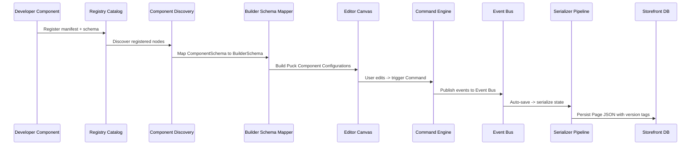

# Data Flow Architecture

This document describes the lifecycle of design configurations, component discovery, visual customizations, and final production rendering in the Klin platform.

## Lifecycle Stages

### 1. Ingestion & Discovery
* Components declare their properties using the builder-agnostic `ComponentSchema` contract.
* The `Registry` catalogues manifest declarations.
* `Discovery` scans catalogs at load time to gather active layouts.

### 2. Schema Transformation
* `BuilderSchemaMapper` normalizes schemas into intermediate `BuilderSchema` descriptors.
* `PuckFieldMapper` translates descriptors into puck editor fields.

### 3. Editor Interaction
* Actions on the canvas (additions, deletions, shifts) dispatch commands through the `CommandBridge` to the `CommandEngine`.
* Executions are validated, updated in memory, recorded in undo/redo history stacks, and published to the `EventBus`.

### 4. Serialization
* The editor state triggers `Serializer` pipeline steps (Normalize → Validate → JSON Conversion → Optimize → Versioning).
* Persists the resulting Page JSON complete with `schemaVersion`, `builderVersion`, and `pageVersion` headers.
