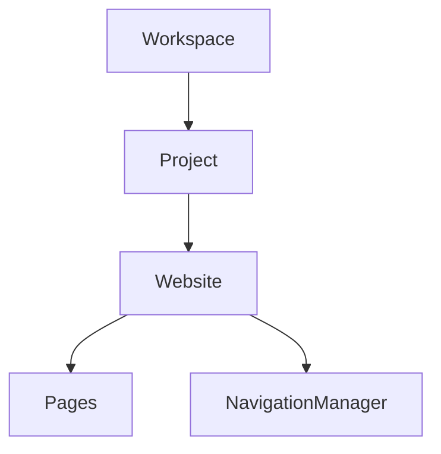

# Page Engine Architecture (v4.1)

This document defines the composition rules, lifecycles, and serialization standards of the Klin Page Engine (`@klin/pages`).

---

## 1. Package Responsibility
The Page Engine serves as the core coordinator mapping Website templates, layouts, routing rules, drafts, and SEO headers to agnostic Render Tree definitions. It decouples customizer content editing from visual output render technologies.

## 2. Core Hierarchy

## 3. WebsiteManager
The `WebsiteManager` orchestrates website definitions at the project level, managing multiple independent web applications within the same workspace.
Key operations:
- `createWebsite()`, `deleteWebsite()`, `renameWebsite()`
- `changeDomain()`
- `setTheme()`
- `setDefaultLocale()`
- `addPage()`, `removePage()`
- `publishWebsite()`, `archiveWebsite()`, `exportWebsite()`

## 4. PipelineRegistry
Transformation processes are orchestrated via `PipelineRegistry`. Instead of a static pipeline stage list, stages can be registered dynamically by plugins with priority weights.
Standard priority order:
1. **DependencyResolution** (priority: 10)
2. **OverrideResolution** (priority: 20)
3. **Validation** (priority: 30)
4. **Optimization** (priority: 40)

## 5. RenderTree Cache
To support high-traffic websites, rendering outputs arecached dynamically:
- **`RenderTreeCache`**: Caches compiled JSON trees.
- **`DependencyCache`**: Caches resolved layout dependency graphs.
- **`ValidationCache`**: Caches validation reports.
- **`PipelineCache`**: Coordinates cache checks to bypass pipeline computation.

## 6. Website Navigation Manager
Separates content routes from custom layout links:
- **`NavigationManager`**: Manages the navigation node structure.
- **`BreadcrumbBuilder`**: Compiles hierarchical path arrays.
- **`MenuBuilder`**: Produces structured headers and footers menu trees.

## 7. Abstract Asset Providers
Asset rendering supports multiple backend providers:
- **`AssetProvider`**: Base interface contract.
- **`CloudinaryProvider`**, **`S3Provider`**, **`SupabaseProvider`**, **`VercelBlobProvider`**, **`LocalProvider`** (standard local storage fallback).

## 8. Draft Comparison Engine
`DraftComparer` calculates differences between volatile page drafts and published versions, returning a detailed change log.
Supports granular rollbacks:
- `restoreSection()`
- `restoreBlock()`
- `restoreProperty()`

## 9. Publishing Pipeline
Publishes compiled render trees to multiple export targets:
- **`PublishingPipeline`**: Manages publish stages.
- **`PublishingStage`**: Executable interface.
- **`PublishContext`**: Specifies targets (`static`, `nextjs`, `wordpress`, `email`, `shopify`, `native`).

## 10. Validation Pipeline
`ValidationPipeline` runs sequential audits:
- **`SchemaValidator`**
- **`RouteValidator`**
- **`SEOValidator`**
- **`ThemeValidator`**
- **`ComponentValidator`**
- **`AccessibilityValidator`**
- **`PerformanceValidator`**

## 11. AI Readiness Contracts
Pre-allocates contracts for layout prompt parsing:
- `PromptContext`, `PromptBuilder`, `LayoutIntent`, `GenerationHints`.
