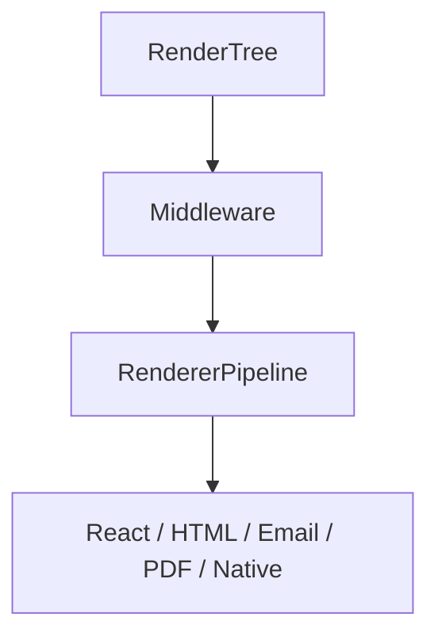

# Renderer Engine Architecture

This document defines the platform targets, pipelines, component mapping mechanisms, and lifecycle states of the Klin Renderer Engine (`@klin/renderer`).

---

## 1. Subsystem Architecture

## 2. Lifecycle States
The renderer transitions through the following stages:
`Created` → `Initializing` → `Resolving Components` → `Resolving Assets` → `Resolving Theme` → `Rendering` → `Hydrating` → `Completed` → `Disposed`.

## 3. Rendering Pipeline
The `RendererPipeline` executes stages in priority sequence. Custom stages can be injected dynamically via plugins.

## 4. Component Resolution
The `ComponentResolver` dynamically translates agnostic `RenderNode` IDs to component implementations registered in `@klin/registry`. Slots (e.g. actions, footer) are processed by `SlotResolver`.

## 5. Theme Resolution
The `ThemeResolver` extracts design tokens compiled by `@klin/theme` and compiles them to raw CSS Variables injected into templates by the `StyleInjector`.

## 6. Hydration Islands System
The `HydrationManager` manages SSR-to-client transitions, allocating state variables and boundary divisions dynamically to render components correctly inside browsers.

## 7. Middleware Layer
A middleware chain (`RendererMiddleware`, `MiddlewareRegistry`) intercepts inputs before rendering begins to inject concerns like analytics tags, cookie banners, or CSP policies.

## 8. Hashing & Optimization
- **`RenderTreeHasher`**: Computes SHA256 hashes of trees to serve as keys.
- **`RenderCache`**: Stores compiled markup.
- **`OptimizationPipeline`**: Optimizes layouts recursively.

## 9. Platform targets
The factory supports:
- **React**: Compiles RenderNodes to native ReactElement arrays.
- **HTML**: Generates static document strings.
- **Email**: Emits inline-styled tables compatible with email clients.
- **PDF**: Generates printable document formats.
- **Native**: Outputs structural JSON representations.

## 10. Diagnostics
`MetricsCollector` and `Inspector` compile timings, component instances, and asset loads.

## 11. Extension Guide
Developers can register custom renderers, stages, and middlewares using `RendererPlugin` hooks.
