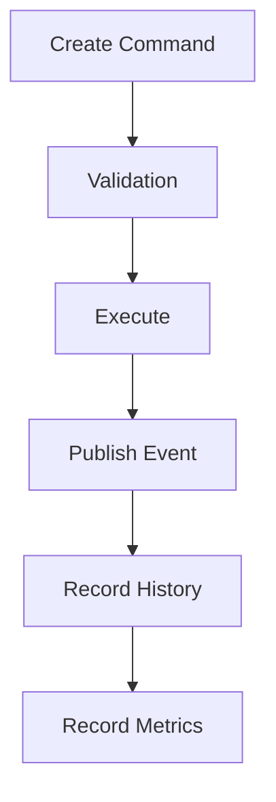

# @klin/command-engine

Visual Builder Command execution engine controlling all editor modifications through transactions, undos, redos, queues, and pipelines.

---

## 1. Core Architecture



---

## 2. Command Lifecycles

Every command goes through states:
`Created` → `Validated` → `Queued` → `Executing` → `Executed` → `Completed` | `Failed` | `RolledBack`

---

## 3. Sub-Categorized Commands

- **builder** (`AddSectionCommand`, `DeleteSectionCommand`, `MoveSectionCommand`, `UpdatePropsCommand`)
- **theme** (`UpdateThemeCommand`)
- **project** (`PublishProjectCommand`)
- **workspace** (`RenameWorkspaceCommand`)

---

## 4. Usage Example

```typescript
import { CommandEngine, CommandContext } from "@klin/command-engine";
import { AddSectionCommand } from "@klin/command-engine";
import { EventBus } from "@klin/event-bus";

const eventBus = new EventBus();
const context: CommandContext = {
  workspaceId: "ws_123",
  projectId: "proj_456",
  userId: "user_789",
  eventBus,
  state: {
    layout: { root: [] },
    selection: { selectedNodeId: null, hoveredNodeId: null },
    theme: {}
  }
};

const engine = new CommandEngine(context);

// Register command class
engine.registry.register("builder.section.add", AddSectionCommand);

// Execute command
const command = new AddSectionCommand({ blockId: "hero", index: 0 });
const result = await engine.execute(command);

if (result.ok) {
  console.log("Section added:", result.value.value); // added section ID
}

// Undo action
await engine.undo();
```
