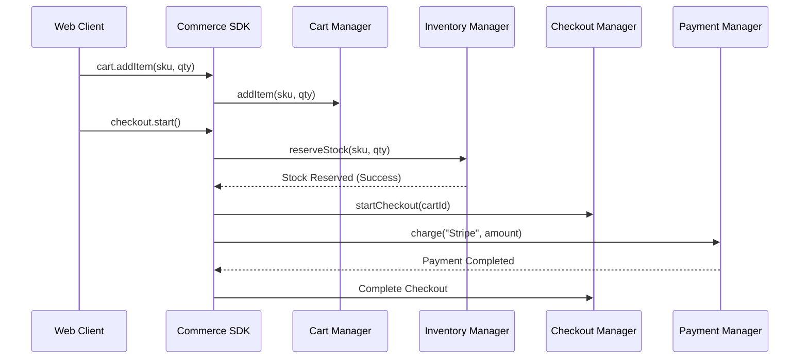

# Commerce Engine Architecture (@klin/commerce)

The Commerce Engine is a fully modular business services platform. It coordinates catalog configurations, stock tracking limits, order registries, tax calculations, and fulfillment workflows independently of render systems.

---

## 1. Directory Blueprint

```
packages/commerce/
├── package.json
├── tsconfig.json
├── COMMERCE_ARCHITECTURE.md
└── src/
    ├── index.ts               # Facade export entrypoint
    ├── di/
    │   └── DIContainer.ts     # Transient and Scoped lifetimes DI Container
    ├── modules/
    │   ├── CommerceModule.ts  # Base modules loader
    │   └── ...Module.ts       # Sub-module hooks (Catalog, Order, Pricing)
    ├── core/
    │   ├── CommerceEngine.ts  # Main orchestrator
    │   ├── CommerceRuntime.ts # Active context tracker
    │   └── CommerceState.ts   # Booting state machine
    ├── catalog/
    │   ├── Product.ts         # Base models
    │   ├── Variant.ts
    │   └── CatalogManager.ts  # Catalog adjustments manager
    ├── inventory/
    │   ├── InventoryManager.ts# Multi-warehouse allocation manager
    │   └── Reservation.ts     # Concurrent checkout hold reservations
    ├── pricing/
    │   ├── PriceEngine.ts     # Tiered price grids resolver
    │   └── TaxEngine.ts       # Locale taxes validator
    ├── cart/
    │   ├── CartManager.ts     # Item quantities manager
    │   └── CartCalculator.ts  # Subtotals aggregator
    ├── checkout/
    │   ├── CheckoutSession.ts # Active checkout session
    │   └── CheckoutManager.ts # Validation workflow
    ├── orders/
    │   ├── OrderManager.ts    # Immutable orders list
    │   └── Refund.ts          # Append-only refund audit logs
    ├── customers/
    │   ├── CustomerManager.ts # Loyalty reward point balances
    │   └── StoreCredit.ts     # Wallet ledger
    ├── payments/
    │   ├── PaymentManager.ts  # Charged amounts delegate
    │   └── ProviderRegistry.ts# Pluggable Stripe vs PayPal adapters
    ├── fulfillment/
    │   ├── FulfillmentManager.ts # Picking list & printable packing slip generator
    │   └── ShipmentManager.ts # Tracking numbers dispatcher
    ├── digital/
    │   └── DownloadManager.ts # Serials and downloads limits checking
    ├── search/
    │   └── SearchEngine.ts    # Faceted catalog search and autocomplete engine
    ├── automation/
    │   └── WorkflowEngine.ts  # Abandoned cart email alerts scheduler
    ├── events/
    │   ├── CommerceEventStore.ts # Append-only event ledger
    │   └── CatalogProjection.ts  # Query-optimized read model projection
    ├── diagnostics/
    │   └── CommerceMetrics.ts # Cart timings & system health inspector
    └── sdk/
        └── CommerceSDK.ts     # Unified entry facade client
```

---

## 2. Dynamic Workflows



---

## 3. Sandboxing & Integrations
Third-party providers (payment gateways, couriers, search engines) register with the registry via specific interfaces (`PaymentProvider`, `CourierProvider`, `SearchProvider`). The core manages actions through interfaces, isolating the platform from third-party bugs.
