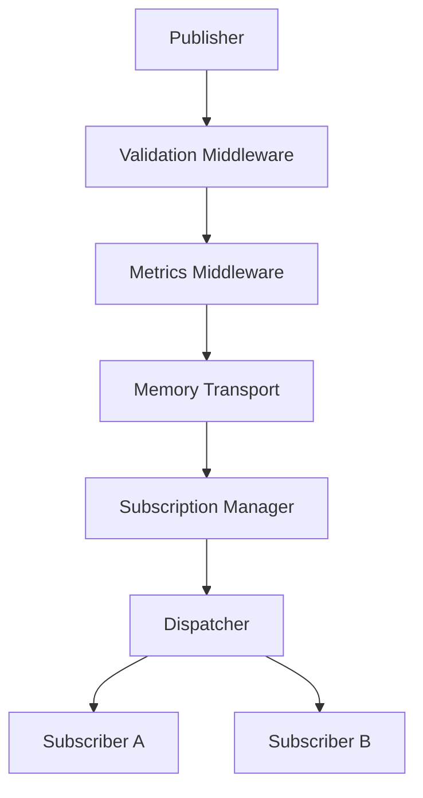

# @klin/event-bus

Pluggable, high-performance namespaced event-driven orchestrator powering the decoupling of Klin platform visual customizer sub-elements.

---

## 1. Core Architecture



### Event Channels
Events are routed into namespaces to avoid global loop congestions:
- **builder** (e.g. `builder.section.added`, `builder.props.updated`)
- **registry** (e.g. `registry.component.registered`)
- **theme** (e.g. `theme.changed`)
- **system** (e.g. default fallback)

---

## 2. Event Structure

Every event is **deeply immutable** once published, carrying correlation context:

```typescript
export interface KlinEvent<T = any> {
  readonly id: string;
  readonly name: string;
  readonly version: string;
  readonly timestamp: number;
  readonly source: string;
  readonly correlationId?: string;
  readonly causationId?: string;
  readonly context: EventContext;
  readonly metadata: EventMetadata;
  readonly payload: T;
}
```

---

## 3. Subscription Model

Subscribers map target listener filters via wildcards:
- Wildcard matches: `builder.*` matches any sub-event starting with `builder.`.
- Namespace matches: `theme.*`.
- Multi-tenant checks: Custom filters (e.g. `(event) => event.context.workspaceId === "x"`).

---

## 4. Usage Example

```typescript
import { EventBus } from "@klin/event-bus";

const eventBus = new EventBus();

// Subscribe to builder events
eventBus.subscriptions.add({
  id: "autosave-listener",
  name: "Autosave Handler",
  eventNamePattern: "builder.*",
  callback: async (event) => {
    console.log("Saving changes for section:", event.payload);
  }
});

// Publish event
await eventBus.getPublisher().publish(
  "builder.section.added",
  { blockId: "blk_123", index: 0 },
  "canvas-editor"
);
```
