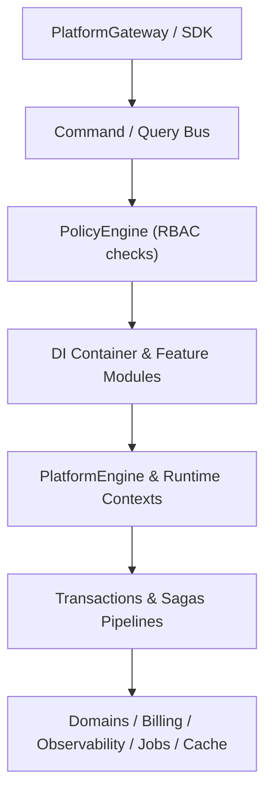

# Klin Platform Engine Architecture (@klin/platform)

The `@klin/platform` package is the core orchestration layer of the Klin SaaS ecosystem. It acts as the business workflow gateway, managing projects, environments, custom domains, distributed locking, background jobs execution, observability telemetry, billing structures, collaborations presence, and sandboxed plugin environments.

## 1. High-Level Modular Design

---

## 2. Core Architectural Blocks

### 2.1 CQRS Command & Query Bus
- **Writes:** Commands (`PublishCommand`, `DeployCommand`) encapsulate layout mutation requests.
- **Reads:** Queries (`GetAnalyticsQuery`, `GetWorkspaceQuery`) decouple layout reads.
- **Access Policies:** Evaluates permissions dynamically (e.g. `policy.canPublish()`).

### 2.2 Transactions & Saga Compensation
- **Compensation Steps:** Transactions (`PlatformTransaction.ts`) orchestrate steps sequentially; if a step fails downstream, executed compensations roll back prior operations.
- **Sagas:** Manages long-running asynchronously queued executions.

### 2.3 Runtimes, Sessions & Locks
- **PlatformRuntime:** Global state variables (e.g. active workspace, loaded plugins, queues).
- **ProjectRuntime:** Context specific to active projects (website instances, preview sessions).
- **PlatformSession:** Request-scoped trace, role, and permission variables.
- **Resource Lock Manager:** Restricts concurrent operations from colliding on the same website.

### 2.4 Service Discovery & DI Container
- Services are registered dynamically in `DIContainer.ts` using Singleton, Transient, or Scoped lifetimes.
- `ServiceDiscovery.ts` locates descriptors and freezes dependencies configurations once initialization completes.

### 2.5 Event Sourcing & Projections
- Emitted event history stores inside `PlatformEventStore.ts`.
- `PlatformEventReplay.ts` supports replaying workflows.
- `ProjectionEngine.ts` processes events into read-optimized projections (`ProjectProjection`, `WorkspaceProjection`).
