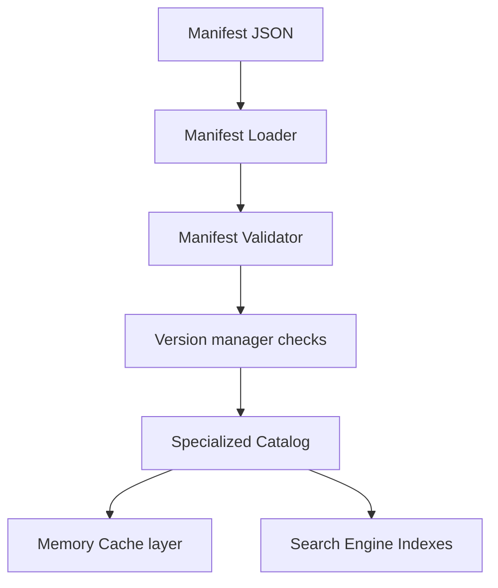

# @klin/registry

Dynamic runtime discovery catalog, SemVer compatibility checker, topological graph manager, memory cache layer, search rank indexer, exporter/importer, and events dispatcher package for the Klin platform.

---

## 1. Core Architecture



---

## 2. Platform Catalogs

Specialized BaseCatalog mappings:
- Components
- Blocks
- Templates
- Themes
- Commands
- Plugins
- Extensions
- Marketplace Packages

---

## 3. Usage Example

```typescript
import { Registry } from "@klin/registry";
import { EventBus } from "@klin/event-bus";

const eventBus = new EventBus();
const registry = new Registry({
  workspaceId: "ws_1",
  projectId: "proj_1",
  userId: "user_1",
  eventBus
});

// Initialize Registry
await registry.initialize();

// Register Package
await registry.register({
  id: "pkg_hero",
  name: "Hero component bundle",
  version: "1.0.0",
  type: "component",
  assets: [
    { id: "hero-section", name: "Visual hero section" }
  ]
});

// Resolve registered component
const item = await registry.resolve("component", "hero-section");
console.log("Component details:", item);

// Shutdown Registry
await registry.shutdown();
```
