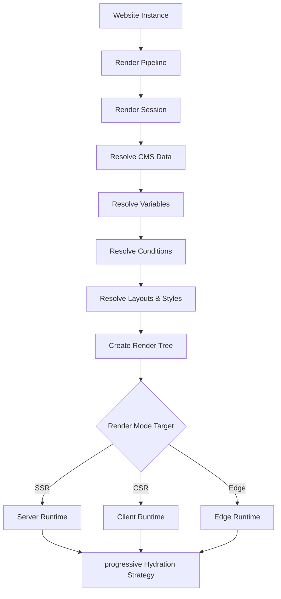

# Renderer Engine Architecture (@klin/renderer)

The Renderer Engine is responsible for rendering Website Instances into fully interactive website payloads across multiple target environments.

## Architecture Diagram

## Key Modules

### 1. Render Session & Context
- **RenderContext:** Isolated request-scoped settings (e.g. active locale, cookies, headers, device viewport).
- **RenderSession:** Unique ID tracking trace paths, diagnostics metrics, and pipeline warnings.

### 2. Rendering Pipeline
- **RenderPipeline:** Manages sequential stages resolving variables (`VariableResolver`), dynamic CMS bindings (`BindingResolver`), layout rules (`LayoutEngine`), styling classes (`StyleResolver`), and assets preloading (`PreloadManager`).

### 3. Progressive Hydration & Islands
- **Islands Engine:** Renders static HTML shells with embedded interactive islands (`IslandRenderer`).
- **Hydration Strategy:** Declares progressive hydration strategies (`Immediate`, `Lazy`, `Visible`, `Interaction`).

### 4. Dependency Tracing Graph
- **RenderGraph:** Tracks block dependencies on CMS fields, variable keys, and tokens to enable fast sub-tree partial updates.
- **AssetGraph:** Maps block layout resources (images, fonts, scripts) to allow asset pruning prior to page deployment.

### 5. AI Traceability & Diagnostics
- **RenderMetadata & AIRenderHints:** Retains conversion logs, confidence indexes, and JSX source properties for round-trip migrations.
- **DiagnosticsManager:** Exposes centralized metrics profiling.
- **DevelopmentOverlay:** Renders layout inspector boundaries and FPS statistics overlay in dev mode.
