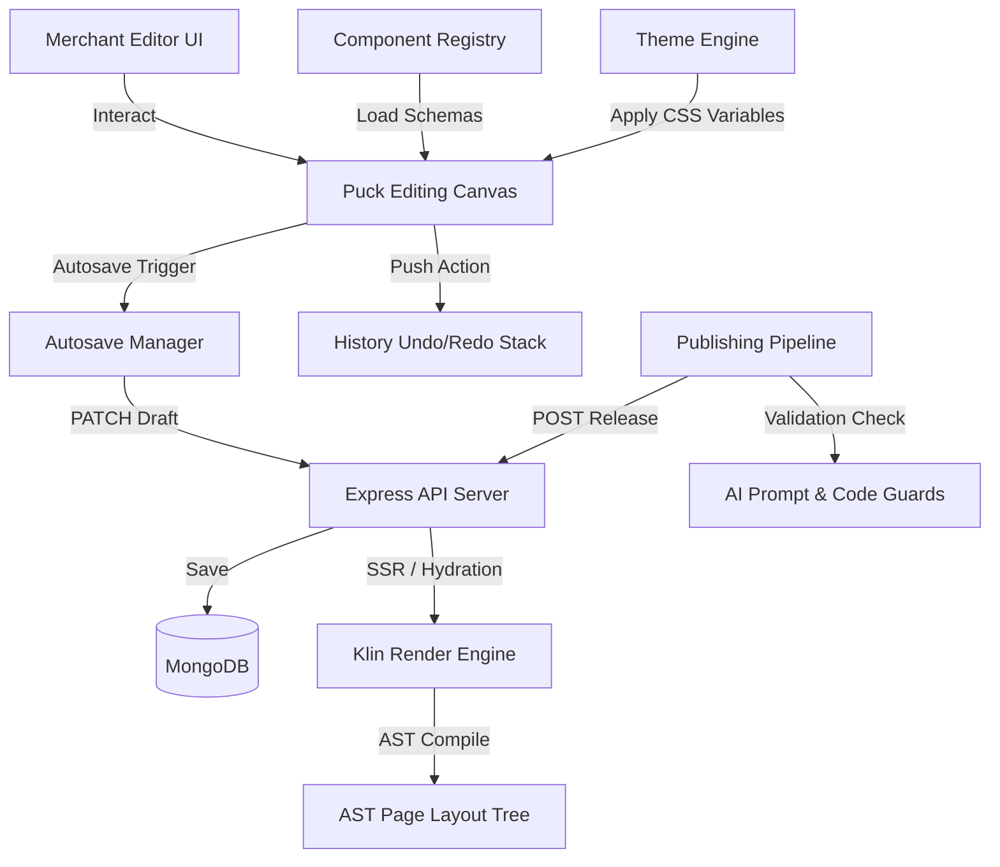

# Klin Core Framework & Component System Architecture

This directory contains the central engine and state management module that powers **Klin**, a next-generation visual storefront editor.

---

## 1. Directory Structure

```
src/lib/klin/
├── README.md               # Dynamic system developer docs & dependency mappings
├── types/                  # Centralized TypeScript definitions
│   ├── core.ts             # Registry & state interfaces
│   ├── components.ts       # Component library manifestation & schema validation
│   ├── templates.ts        # Page/structure JSON schema and migrations
│   ├── theme.ts            # Dynamic CSS variable tokens & theme resolver
│   ├── puck.ts             # Puck integration hook & config interfaces
│   ├── renderer.ts         # SSR & Hydration properties
│   └── publishing.ts       # Versioning, drafts, rollback operations
├── core/
│   ├── registry.ts         # Monolithic registry for component definitions
│   └── state.ts            # Global configuration & editor engine initialization
├── components/
│   ├── loader.ts           # Dynamic component resolver
│   ├── manifest.ts         # Component manifest checker & schema validator
│   └── validator.ts        # Props & schema compliance validator
├── templates/
│   ├── engine.ts           # Layout generator & tree assembler
│   ├── schema.ts           # JSON schemas for template.json validation
│   └── migration.ts        # Schema-version updater (migrations)
├── theme/
│   ├── resolver.ts         # Map theme JSON to dynamic Tailwind CSS custom properties
│   ├── tokens.ts           # Token definitions (colors, typography, spacing)
│   └── validator.ts        # Validate theme structure constraints
├── puck/
│   ├── integration.ts      # Main bridge defining Puck components from registry
│   ├── history.ts          # Undo/Redo delta stack manager
│   └── plugins.ts          # Puck plugins (e.g. state interceptors, autosave)
├── renderer/
│   ├── parser.ts           # Component tree AST compiler
│   └── engine.tsx          # Universal React Renderer (supports SSR/Hydration)
├── publishing/
│   ├── pipeline.ts         # Publishing pipeline (Draft -> Optimize -> Release)
│   └── autosave.ts         # Debounced remote/local sync engine
├── plugins/
│   └── manager.ts          # Plugin lifecycle & hook registry
├── sdk/
│   ├── validator.ts        # Dev kit local compiler validation
│   └── cli-mock.ts         # Mock compiler API for dev build scripts
└── ai/
    └── rules.ts            # AI prompt schema validator (prevents raw HTML output)
```

---

## 2. Architecture & Data Flow



---

## 3. Communication Model

1. **Registry & Puck**:
   All storefront elements must register in the `registry`. During startup, the Puck adapter loops over registered components, generates input schemas, and provides dynamic configurations to Puck.
2. **Theme Resolver**:
   Theme settings are fetched as JSON and mapped directly to CSS Custom Properties (Variables) on the DOM. Components read spacing, colors, and border settings from these variables.
3. **Drafting & Persistence**:
   Changes in the Puck Editor are debounced using the `AutosaveManager`. When triggered, they perform `PATCH /api/store-design/draft` transactions. If offline, drafts fallback to browser localStorage.
